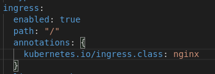
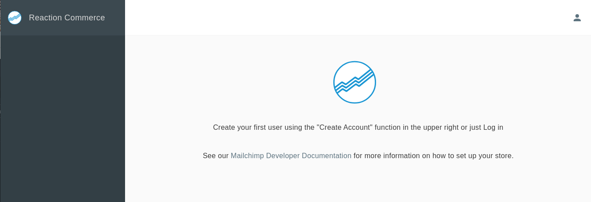
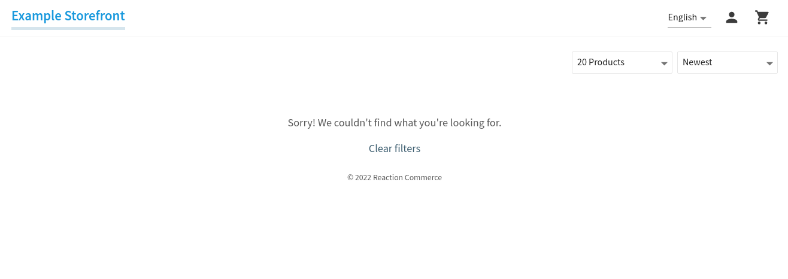

# **Deploying Mailchimp Open Commerce on to a Cloud Hosted Kubernetes Cluster**

## **Introduction**

MailChimp Open Commerce is an open source, API-first, modular commerce
stack made for technical, growth-minded retailers.

The purpose of this document is to provide guidance on deploying an Open
Commerce environment on to a cloud hosted Kubernetes cluster using the
provided Helm charts to streamline the deployment process. This guide
has been written to be as cloud agnostic as possible so some reference
to your chosen cloud providers documentation may be required for
particulars (such as SSL certificate generation and hosting, load
balancing/ingress, etc...) although the basic steps and deployment
approach (Helm) should be the same regardless of chosen cloud.

## **Prerequisites**

As this document is focused upon deploying MailChimp Open Commerce,
using Helm, some working knowledge of your chosen cloud provider and
Kubernetes is required. For example, you will need a cloud hosted
Kubernetes environment, and relevant administration/deployment
permissions to said environment, before being able to proceed with the
below. You will also need **kubectl** installed and configured to
proceed.

This documentation has been written for and tested on Linux specifically
(Fedora 35), but all the included tools and components are also
available for other operating systems such as Windows and Mac. Please
consult each components/tools bespoke documentation for guidance
regarding non-Linux installation and configuration.

## **Components**

Cloud Provider: Cloud vendors offer a multitude of third-party hosting
services and solutions, including compute, networking, and
storage. As mentioned, an account with a chosen cloud provider is
required, with sufficient access privileges, to follow along with this
guide.

[Kubernetes](https://kubernetes.io/): Kubernetes, also known as K8s,
is an open-source system for automating deployment, scaling, and
management of containerized applications. You will require an active
cloud hosted Kubernetes environment before being able to proceed with
the following.

[Kubectl](https://kubernetes.io/docs/tasks/tools/): The Kubernetes
command-line tool, kubectl, allows you to run commands against
Kubernetes clusters. You can use kubectl to deploy applications, inspect
and manage cluster resources, and view logs.

[Kubernetes Ingress
Controller](https://kubernetes.io/docs/concepts/services-networking/ingress/):
Ingress exposes HTTP and HTTPS routes from outside the cluster to
services within the cluster. Traffic routing is controlled by rules
defined on the Ingress resource. Although utilising Ingress is optional,
for the purposes of this document we shall assume that an Ingress
Controller is deployed to the target Kubernetes environment and shall be
utilising its services.

[Helm](http://Helm): Helm helps you manage Kubernetes applications
-- Helm Charts help you define, install, and upgrade even the most
complex Kubernetes application. To deploy packaged Kubernetes manifests
using Helm you will require administration/deployment privileges to your
chosen Kubernetes environment.

## **Authentication to Kubernetes Cluster**

Prior to deploying a Helm chart, you must ensure that you have
authentication configured to the target Kubernetes cluster.
Authentication configuration can be dependent upon your chosen cloud
provider, but it typically involves the setup of your local
\~/.kube/config file with relevant
[**credentials**](https://kubernetes.io/docs/reference/access-authn-authz/authentication/)
to connect to your Kubernetes cluster. Consult your cloud provider
documentation for further information.

Authentication can be confirmed using a simple command such as the
following.

```
kubectl get pods --A
```

If a list of pods is returned, then you are successfully authenticated
and connected to your Kubernetes environment.

## **Install Helm**

We need to install **Helm** which, as mentioned above, works as the
Kubernetes package framework for our Open Commerce deployment.

1.  The simplest method of installing Helm upon Linux is via provided
    [**installation
    script**](https://helm.sh/docs/intro/install/#from-script). A
    benefit of using the install script is that it should work across
    the most popular Linux distro's and is not tied to a particular
    package manager such as **apt** or **dnf**.

2.  Simply run the following commands to perform the Helm install.

    ```
    curl -fsSL -o get_helm.sh https://raw.githubusercontent.com/helm/helm/main/scripts/get-helm-3
    chmod 700 get_helm.sh
    ./get_helm.sh
    ```

3.  The helm installation can be verified by running "helm version".

    ```
    helm version
    ```
    > 

## **Clone Open Commerce Helm Chart**

Next, we need to clone the Open Commerce Helm chart locally prior to
deployment.

1.  Begin by creating a new local directory and then cloning the Helm
    chart repository.

    ```
    mkdir helm
    cd helm
    git clone https://github.com/reactioncommerce/mailchimp-open-commerce-helm-chart
    ```

    > 

## **Prepare Values File**

Now that we have the Helm chart available locally the next step is to
prepare a values yaml file that contains all the necessary configuration
for your deployment. Although the provided **values.yaml** file contains
sensible defaults it will still require changes that are specific to
your deployment and cloud infrastructure.

1.  Begin by creating a copy of the provided values.yaml file.
    
    ```
    cd mailchimp-open-commerce-helm-chart/ && cp ./values.yaml
    ./my_values.yaml
    ```

    > 

2.  Open the my_values.yaml file in your editor of choice (we are using
    [*VS Code*](https://code.visualstudio.com/) in the below
    screenshots).

3.  Begin by editing the values under **global**.

    > 

    If using Stripe or Segment, then set their API keys as required.

    > 

    Ensure that **tokenSecret **is changed to a unique and secure value
    from the placeholder.

    > 

4.  Update the values under **admin** as required.

    > 

    Of particular importance here is that the **host** value is set as
    the FQDN you wish to use for accessing the Open Commerce
    Administration portal.

    > 

    Other values such as **replicaCount** can be amended as you see
    fit.

5.  Next update the values under the **api** sub-section.

    > 

    Again, of particular importance here is the **host** value, ensure
    it is set to the FQDN you wish to use for accessing the Open
    Commerce API endpoint.

    > 

    You may also wish to uncomment and set the
    **enableGraphQlPlayground** to true if you wish to explore the API
    via the GraphQL Playground (recommended for Dev deployments).

    > 

6.  Next move on to the **web** subsection. Which you may wish to
    disable completely if you only require a headless deployment of Open
    Commerce.

    > 

    The example storefront can be disabled via simply setting
    **enabled** []{#anchor-2}to false. We shall leave as true for the
    sake of this deployment.

    > 

    Once again, of particular importance here is the **host** value,
    ensure it is set to the FQDN you wish to use for accessing the Open
    Commerce example storefront.

    > 

    Ensure that the **sessionSecret** is updated to a unique and secure
    value from its placeholder value.

    > 

7.  Finally move on to the **mongoDB** subsection.

    > 

    If you wish to utilise a separate MongoDB instance (such as one
    provided via [**MongoDB Atlas**](https://www.mongodb.com/atlas) then this entire subsection can be disabled (you will
    also need to uncomment and update the **global.mongoUrl** with a
    connection string). But for the purposes of this document, we shall
    be deploying a Kubernetes hosted MongoDB instance so shall leave
    **enabled** set as true.

    > 

    Update the **rootPassword** to a unique and secure value from its
    current placeholder value.

    > 

    Note: The Kubernetes hosted MongoDB instance should not be
    considered production ready and is only suitable for development or
    demonstration purposes.

## **Ingress**

As previously mentioned, this document assumes that an Ingress
Controller is available on our Kubernetes environment. Dependent upon
the Ingress Controller being used it may be that additional ingress
annotation values need adding to our **my_values.yaml** file. For
example, if using the Nginx ingress controller then the following
annotations will need adding under the **admin**, **API**, and **web**
subsections.

```
kubernetes.io/ingress.class: nginx\
```

> 

Also, if using Nginx ensure that the following annotations are also
added under the **admin **subsection.

```
nginx.ingress.kubernetes.io/ssl-redirect: "false",

nginx.ingress.kubernetes.io/proxy-buffer-size: "128k",

nginx.ingress.kubernetes.io/proxy-buffers-number: "4",

nginx.ingress.kubernetes.io/proxy-send-timeout: 3600,

nginx.ingress.kubernetes.io/proxy-read-timeout: 3600
```

> 

## **SSL (Optional)**

If you wish to prepare and configure SSL/TLS certificates for your
deployment then these will need to be generated and signed by a trusted
public Certificate Authority, ensuring that the FQDN values used above
are included as the Subject or Subject Alternative Name within the
certificate. These certificates will then need to be added to your
Kubernetes cluster as a secret which can in turn be referenced within
the **my_values.yaml** (under the admin, api and web subsections).

> 

This process is out of scope for this document though, consult your
cloud providers documentation and the official Kubernetes documentation
for further information. We shall not be configuring and using SSL for
our deployment.

## **Deploy Helm Chart**

With our values file prepared we can now move on to the deployment of
our Open Commerce Helm chart.

1.  First, we need to download our chart dependencies.

    ```
    helm dependency update
    ```

    > 

2.  It is recommended to initially perform a "dry run" of our deployment
    to ensure there are no issues with our provided values or the chart
    itself. This can be done using the following command.

    ```
    helm install opencommerce . -f ./my_values.yaml --dry-run
    ```
3.  If no errors occur with the "dry run" deployment, then we are ready
    to perform the actual deployment.

    ```
    helm install opencommerce . -f ./my_values.yaml
    ```

    > 

4.  It will take several minutes for all the Kubernetes objects to
    deploy and initialise, particularly the MongoDB pods. The deployment
    process can be monitored.

    ```
    watch kubectl get pods --A
    ```

    > 

    When all the pods []{#anchor-5}are "Running" and stable then the
    deployment is complete.

## **DNS**

With our Open Commerce deployment completed we now need to create public
DNS records, that match the configured FQDN's, so that the Admin, API
and Web endpoints are publicly accessible.

We must first attain the public IP address of our Ingress objects load
balancer; this can typically be done using the following command.

```
$ kubectl get service --A
```

You should see a **LoadBalancer** object that has an **EXTERNAL-IP** assigned. 
This address is the external IP of the clusters Ingress Controller.

You should create a public DNS record for each FQDN configured (Admin,
API and Web) that uses the FQDN as the source and the external IP as the
destination.

## **Endpoints**

Finally, with our Helm deployment complete and our external DNS records
in place we can now test our Open Commerce endpoints are accessible
using the FQDN's configured. If all is well then you should be able to
access the []{#anchor-6}Admin console, the example Storefront, and the
API.

> 

> 

Note: As we did not utilise SSL certificates for our deployment it is
likely that the Web Browser will complain when connecting to our URL's,
this warning can be ignored as this is not an example of a production
grade deployment.

## **Custom Open Commerce Container Images**

If you have developed your own custom Open Commerce images (most likely
for the API service) and you wish to deploy them via the Helm chart,
then you would simply need to host them on a publicly accessible
container registry (such as Docker Hub) and update the
**my_values.yaml** values to utilise the custom images tag and its
repository.

> 

## **Final Remarks** 

Although you now have a fully functional cloud hosted Open Commerce deployment it is important that this deployment is not considered production ready. To achieve production readiness much more configuration would be required, in terms of scaling, security, high availability, amongst other areas of concern.
